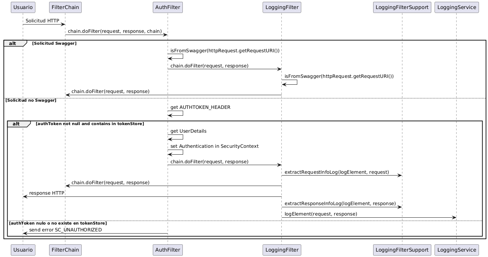
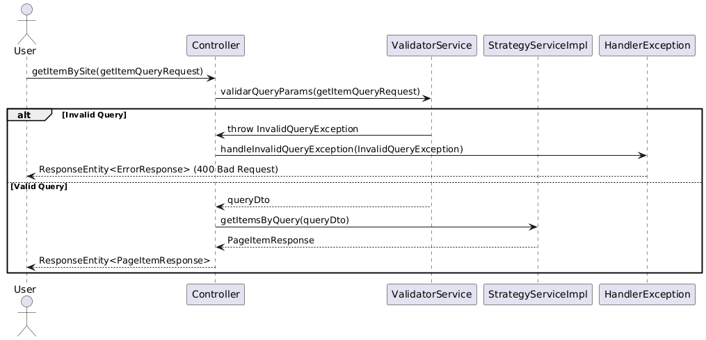
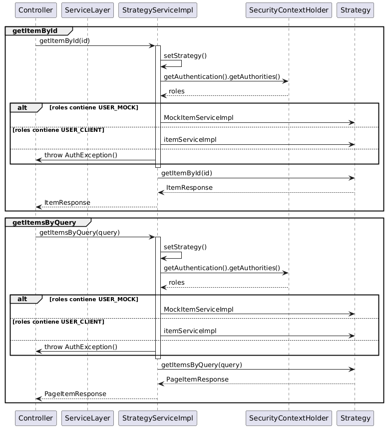
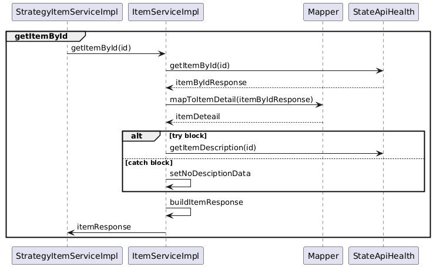
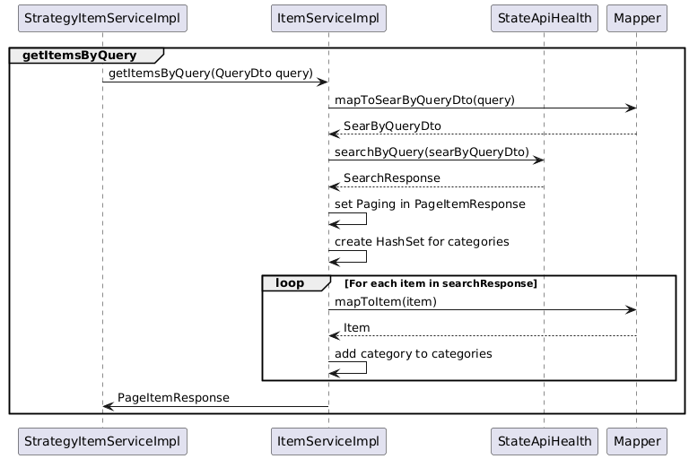
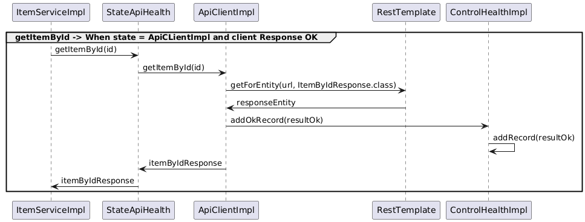
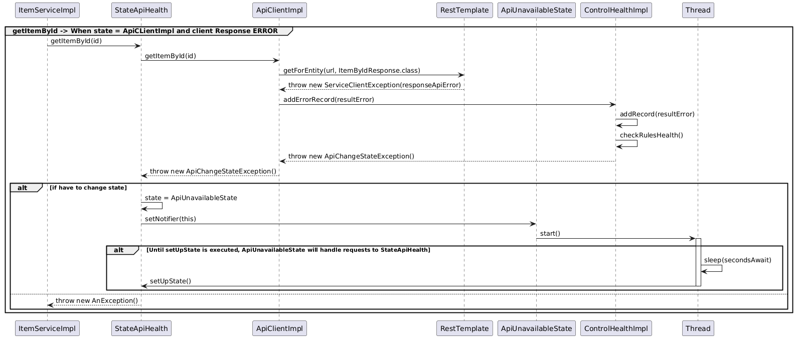
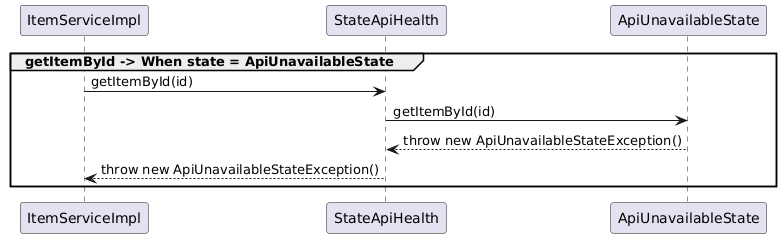

# Mercado Libre Product Search API

## Descripción

Esta API permite realizar búsquedas de productos en Mercado Libre, así como obtener detalles específicos de un ítem. Implementa la arquitectura REST y está desarrollada con Spring Boot. La API admite búsquedas en tres sitios (MLA, MLB, MLM) y ofrece funcionalidades como ordenamiento por precio, paginación y filtrado por token de autenticación.


[1 - Requisitos](#Requisitos)

[2 - Instalación y Ejecución](#Instalación-Ejecución)

[3 - Documentacion](#Documentacion)


## Requisitos


- **Java 17**: Asegúrate de tener instalada la versión 17 de JDK. Puedes descargarlo desde [AdoptOpenJDK](https://adoptopenjdk.net/) o [Oracle](https://www.oracle.com/java/technologies/javase-jdk17-downloads.html).
- **Maven 3.8.2**: Necesario para gestionar dependencias y construir el proyecto. Descárgalo desde [Maven](https://maven.apache.org/download.cgi).
- **Docker**: Utilizado para contenerización y despliegue de la aplicación. Asegúrate de tener Docker instalado. Puedes obtenerlo desde [Docker](https://www.docker.com/get-started).

## Instalación-Ejecución


### Clonar el repositorio:

```
git clone https://github.com/matiasariel1990/MeliMiddleEndTest.git
```
Ingresamos a al directorio.
```
cd MeliMiddleEndTest
```
### Compilación

```
mvn clean install
```
### Configurar la aplicación:
En el archivo application.properties, puedes configurar las variables de la app.


### Ejecutar la aplicación:
Esta aplicacion tiene dos variables de entorno principales, se deben setear las mismas para poder ejecutar la app.
Reemplaza los valores de value1 y value2 por los tokens auth.
```
set "auth.token.client=value1" && set "auth.token.clientmock=value2" && mvn spring-boot:run
```

## Docker
Asegúrate de tener Docker instalado y en ejecución. Construye la imagen Docker usando el Dockerfile:
```
docker-compose build
```
Ejecuta el contenedor (No te olvides de cambiar las variables de entorno!).

```
docker-compose up
```

## Documentacion 

## Swagger UI
La documentación de la API está disponible en
http://vps-4093291-x.dattaweb.com:8080/swagger-ui/index.html


## Flujo de la App

### Filters
A continuación se muestra el diagrama de secuencia que describe el flujo a través de la cadena de filtros en la aplicación:


### Controller
Pasados los filtros entra a la capa del controlador.


### StrategyService
La estrategia de resolusion depende del rol con que se consulta.


### ItemServiceImpl
Si entramos con un rol de usuario...



### Api Client
En la capa de cliente, derivamos la respuesta al estado, el estado de la api depende de los ultimos registros.
Cada vez que recibimos un error del RestClient, verificamos el estado de salud, 
y de no cumplir con las reglas configuradas en aplication.properties, damos de baja el servicio por el tiempo configurado.



